# Evidencias del Proyecto - Cinespoilers

## Integrantes
- Sheila Diaz Rojas
- Naomi Sanchez Chavarria

# Evidencias de LAB-05 Sheila Diaz Rojas

## 01. Panel de administracion de Django
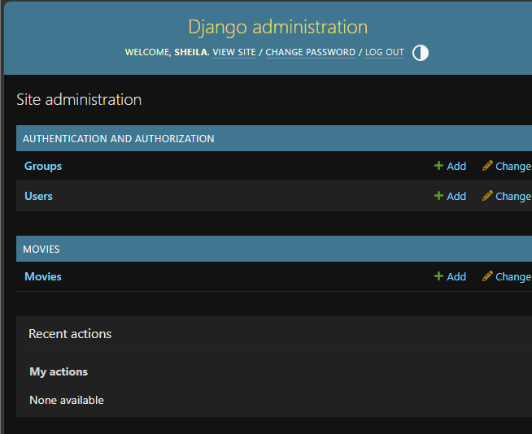

## 02. Preparacion del entorno
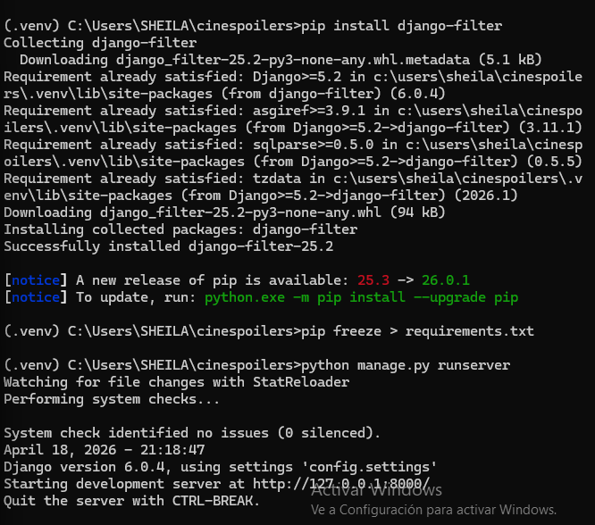

## 03. Crear pelicula desde el admin
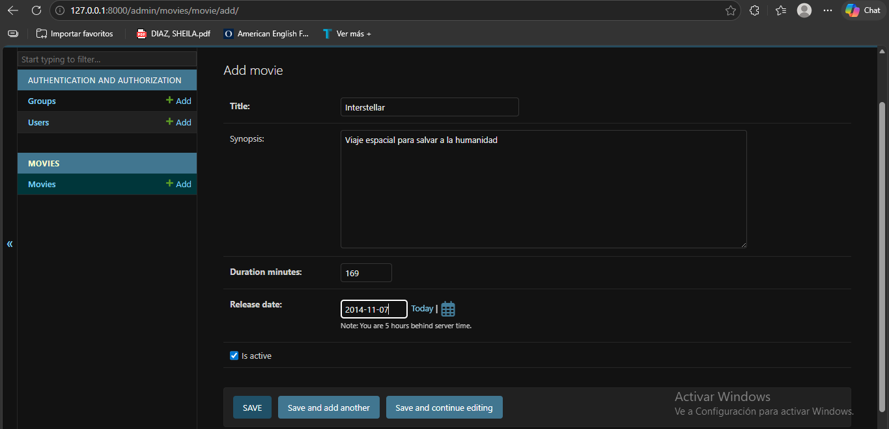

## 04. Busqueda de peliculas en la API
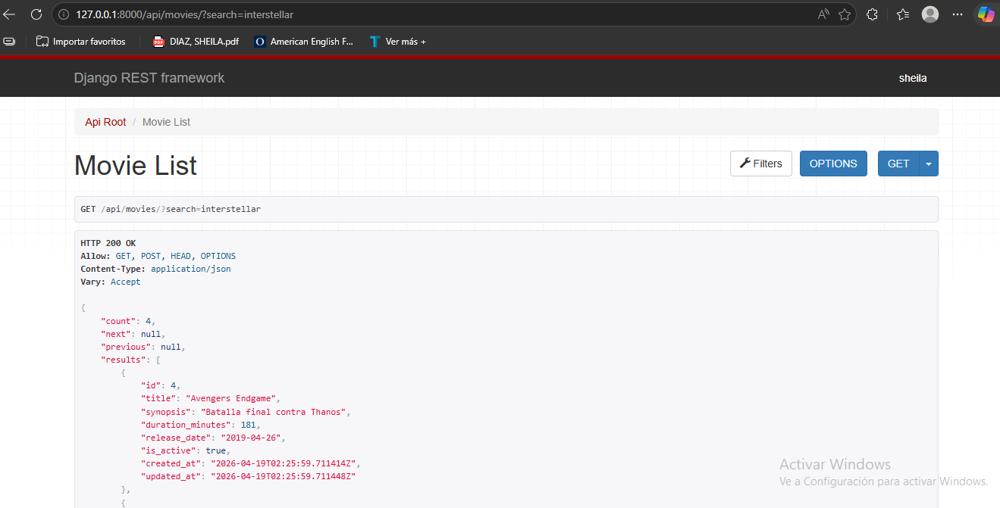

## 05. Creacion de pelicula desde la API
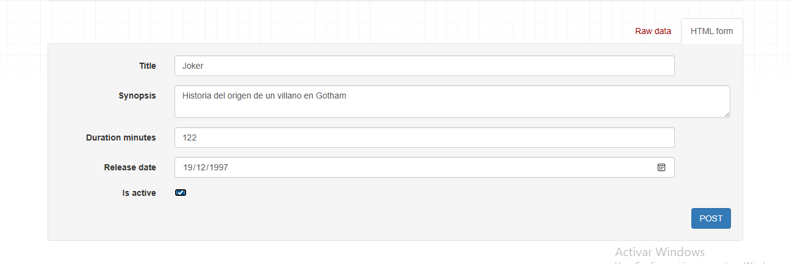

## 06. Eliminacion de pelicula completada
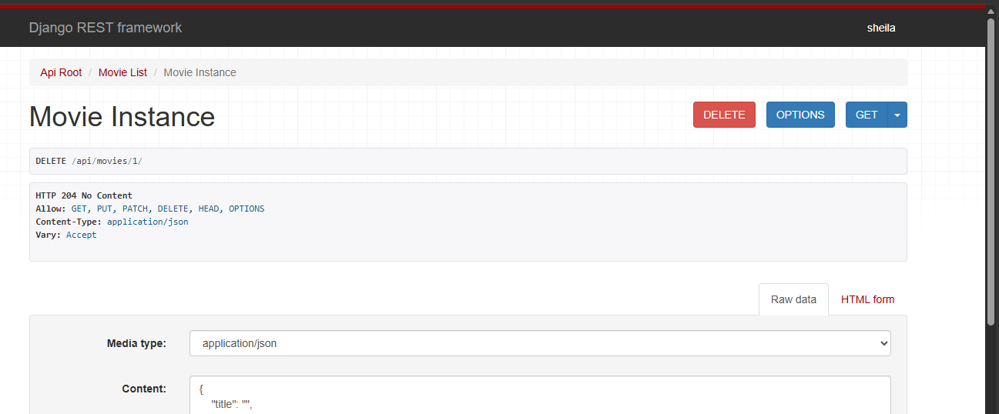

## 07. Ordenamiento de peliculas
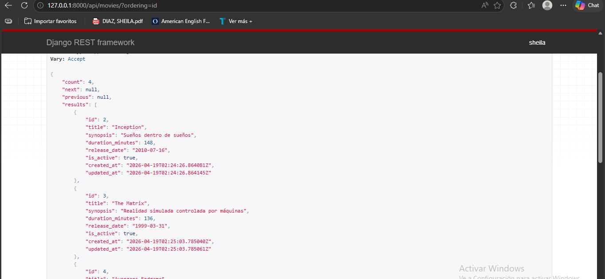

## 08. Actualizacion de pelicula con PATCH
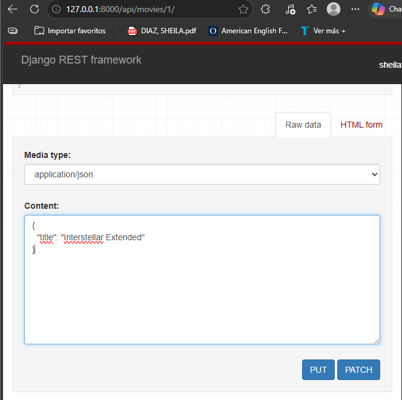

# Evidencias de LAB-06 

## 09. Lista de géneros
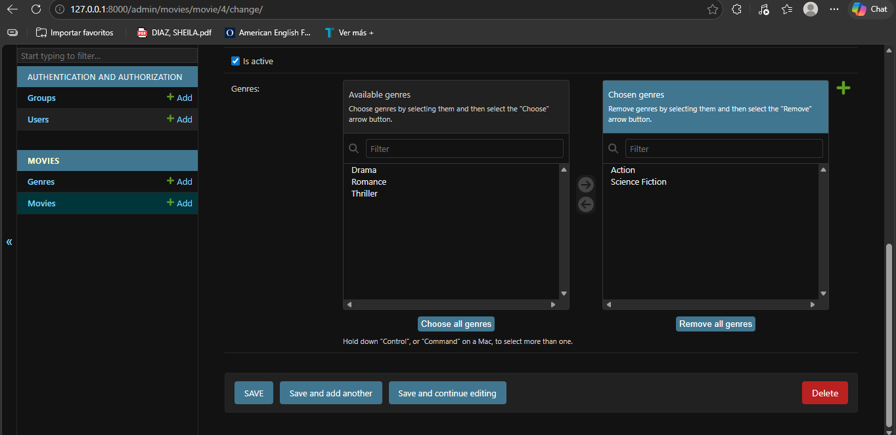

## 10. Películas con géneros
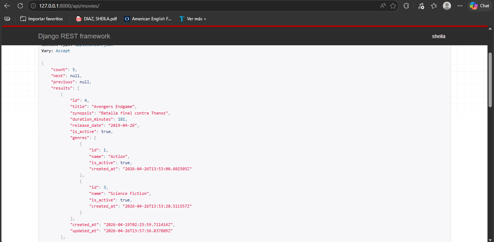
 
 # Evidencias de Naomi Sanchez Chavarria

 ## 01.Inicialización de DJANGO
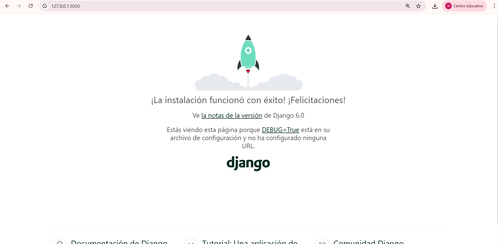

## 02.Configuración, Implementación y ejecución del código para CINESPOILERS
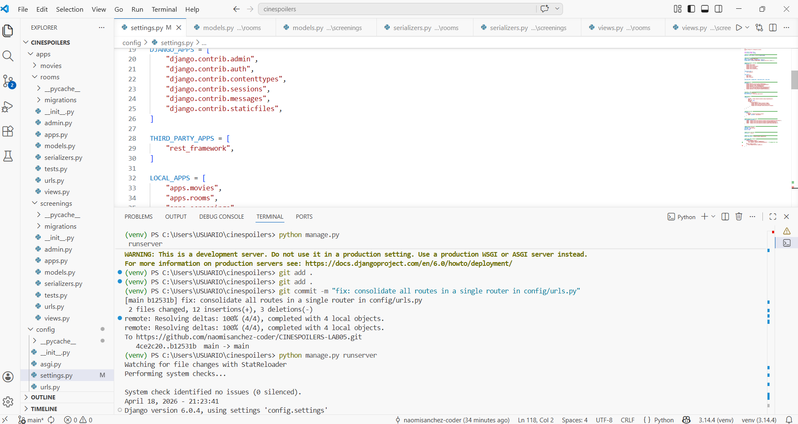

## 03.Prueba en POSTMAN NAVEGADOR
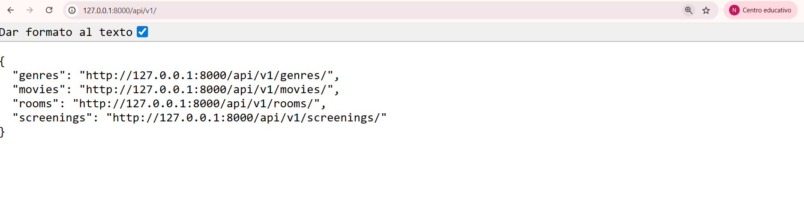

## 04.Fronend en ejecución de CINESPOILERS
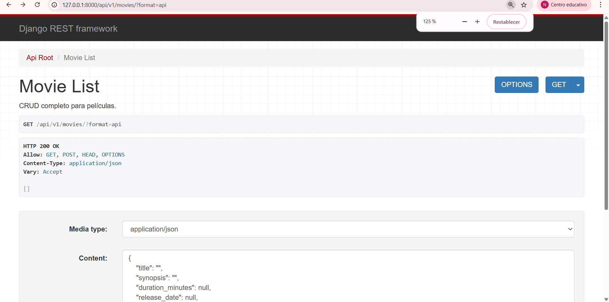

## 05.Registro de Película completada
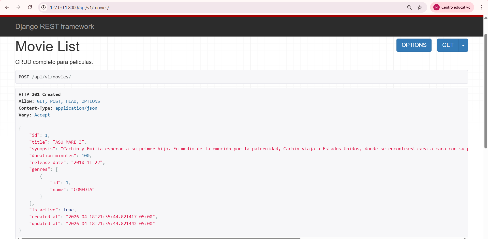